# Tutorial For Sanity-Checking Your Submission

This document is meant to walk you through the steps of creating an algorithm on grand-challenge.org and requesting that it be run on the three "sanity check" cases in order to make sure that everything is working properly for the final test set.

## Make Sure Your Docker Is Expecting The **UPDATED** I/O Format

This had to be changed on August 30th due to a misunderstanding by the organizers. The important changes are:

- Grand Challenge can only support .mha files, not .nii.gz
- Rather than `/input`, the input files are mounted at `/input/images/ct`
- Rather than `/output`, the output files are expected at `/output/images/kidney-tumor-and-cyst`

The [example dummy submission](https://github.com/neheller/kits21/blob/master/examples/submission/dummy_submission/run_inference.py) has been updated to fit this format. You might find it helpful.

## Make Sure Your Dockerfile Doesn't Run As Root

This can typically be resolved by simply adding the following to the end of your Dockerfile

```Dockerfile
RUN groupadd -r myuser -g 433 && \
    useradd -u 431 -r -g myuser -s /sbin/nologin -c "Docker image user" myuser

USER myuser

CMD python3 ./run_inference.py
```

## Make Sure to GZip Your Saved Container

You can do this with the following command (assuming you have built the container with the tag `-t my_submission`):

```bash
docker save my_submission | gzip -c > test_docker.tar.gz
```

## "Create an Algorithm" On Grand Challenge

Log-in to grand-challenge.org and click "Algorithms" at the top of the page.

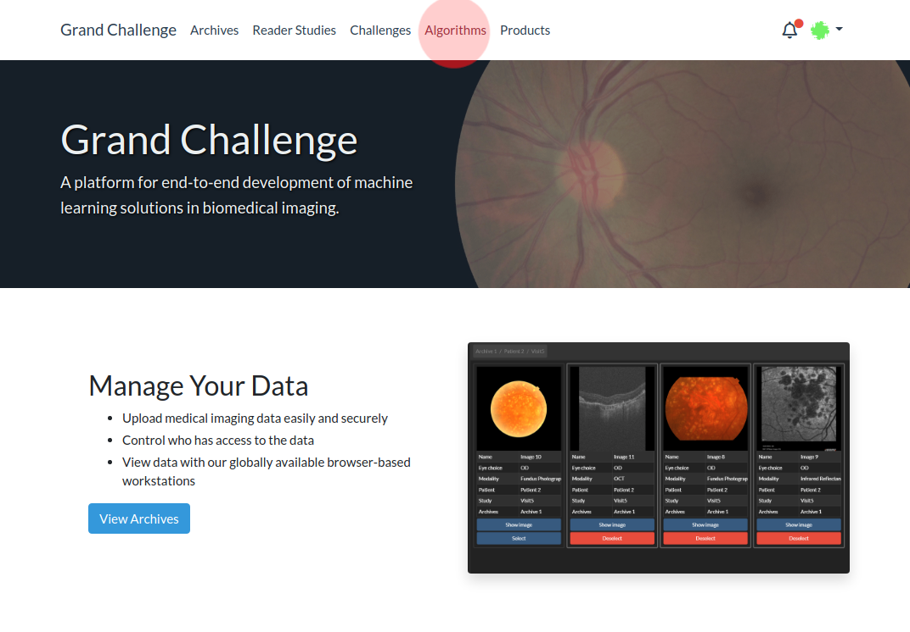

Then click "Add New Algorithm" in the middle of the page. 

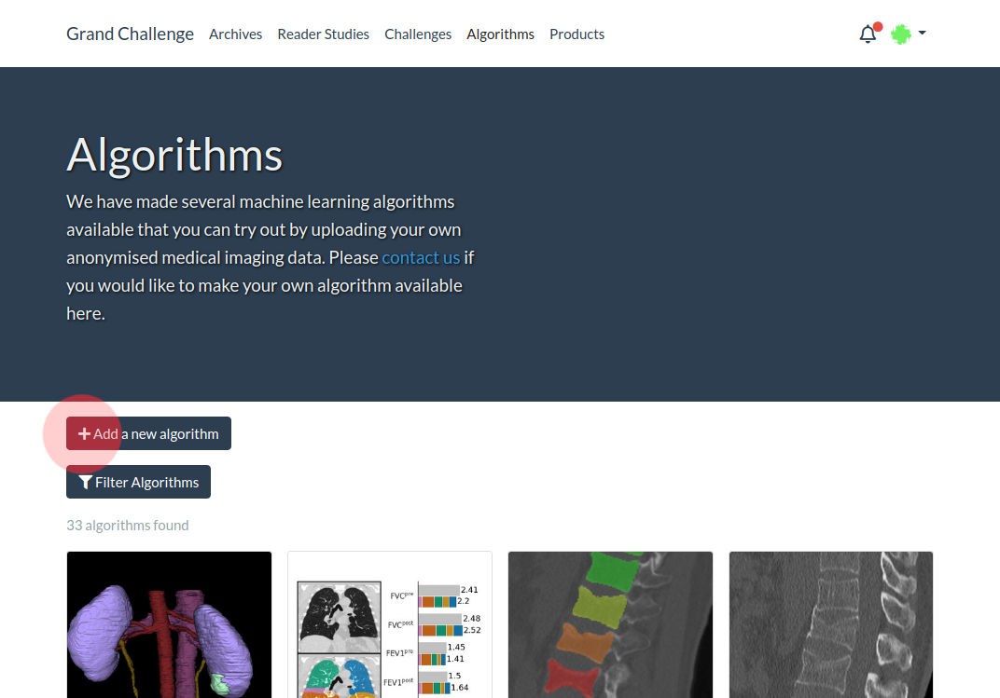

**If this option is not shown, make sure you are registered for the KiTS21 challenge [here](https://kits21.grand-challenge.org/participants/registration/create/).**

This button will take you to a form where you will need to provide some metadata about your approach. You can use any name and image that you like, but make sure to fill out the rest of the marked fields as shown below.

Your algorithm will be created only once, and you can update it with new containers later, so don't worry about describing different versions here.

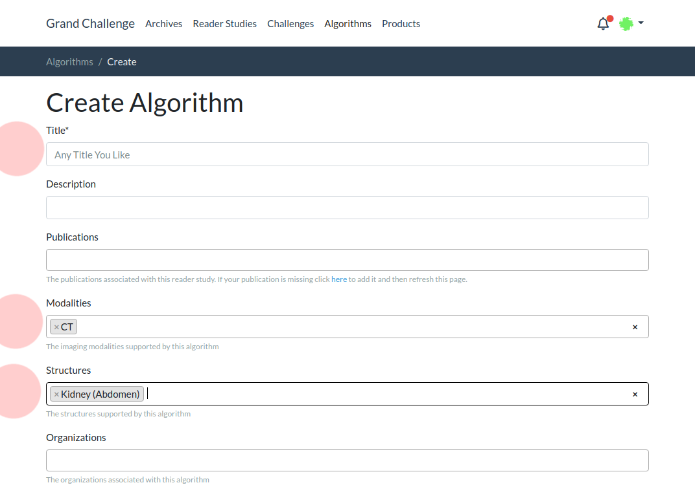

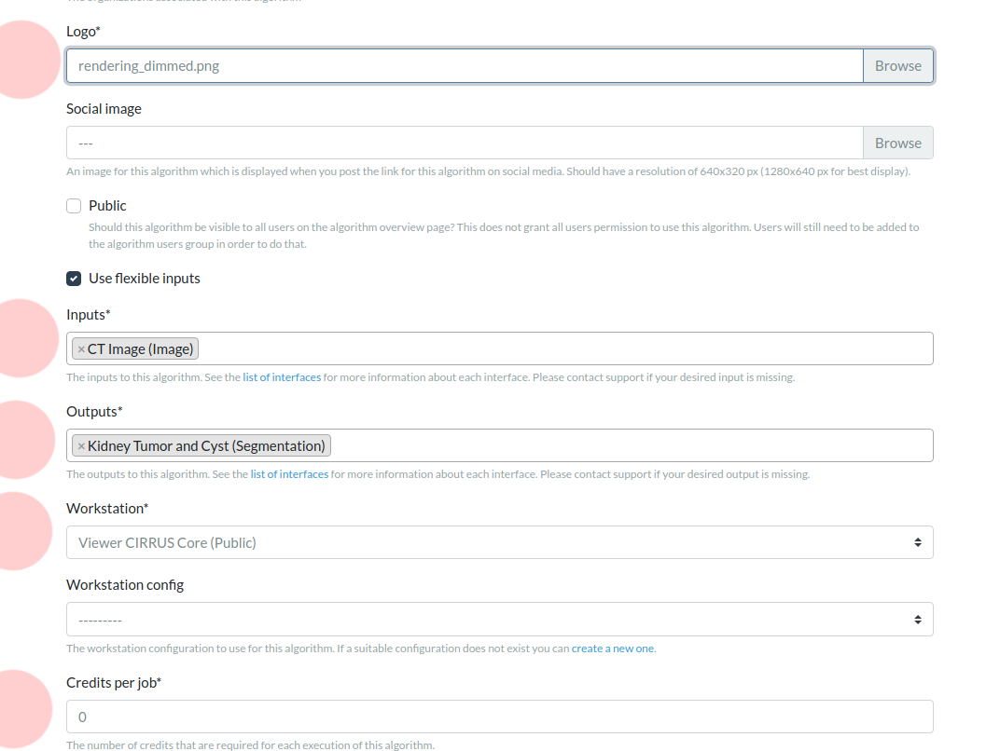

**It's especially important to mimic the above for the "Inputs" and "Outputs" fields.**

## Make `helle246` a User of Your Algorithm

In order for us to run the algorithm on your behalf on the sanity check cases, you must make `helle246` a user of your algorithm. Do this by first going to "Users" on the left hand side.

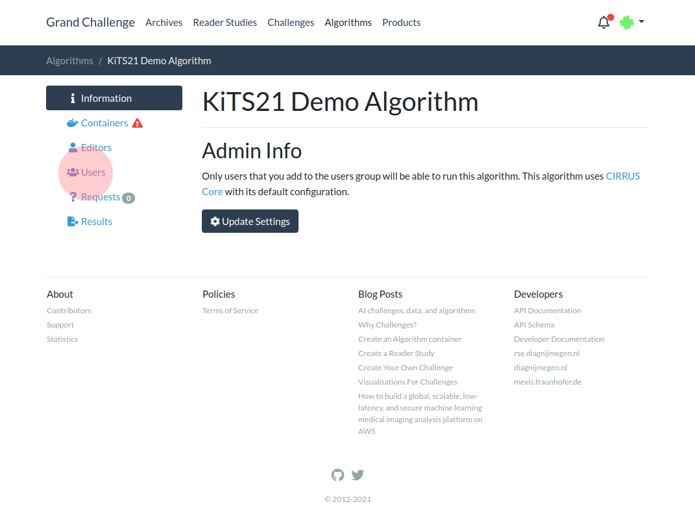

Then clicking on "Add Users"

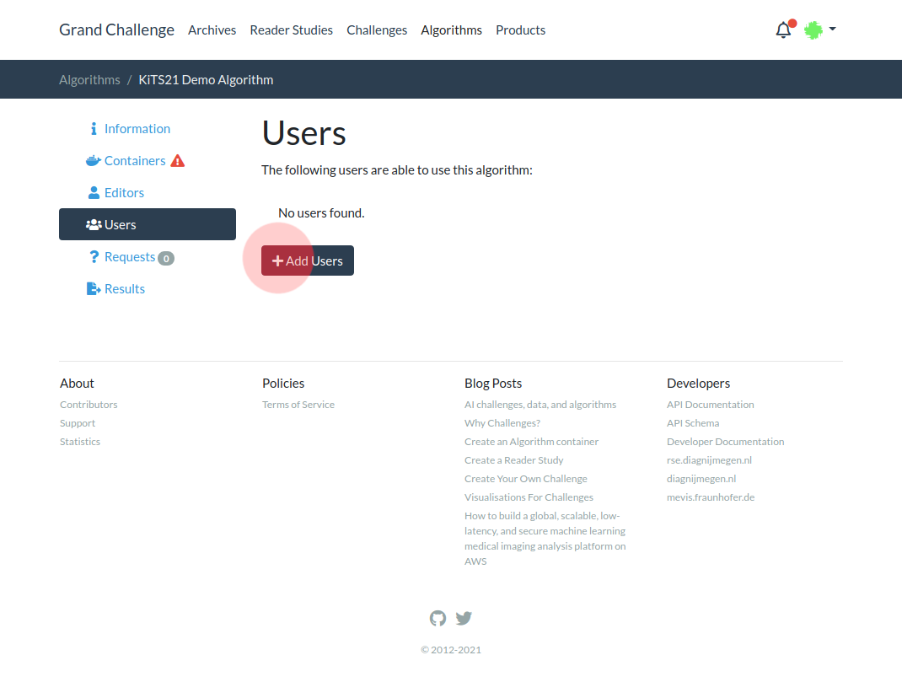

Then typing in "helle246" and clicking "Save".

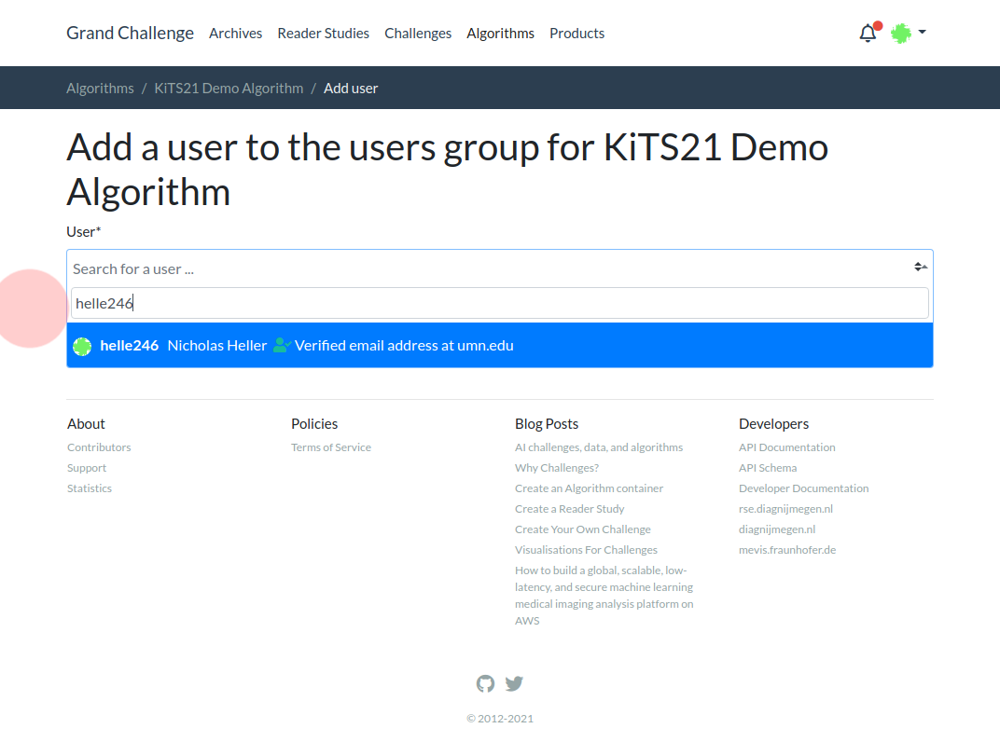


## Upload Your `.tar.gz` Docker Container

Now go back to your algorithm and click "Containers" on the left hand side.


Once there, click on "Upload a Container"

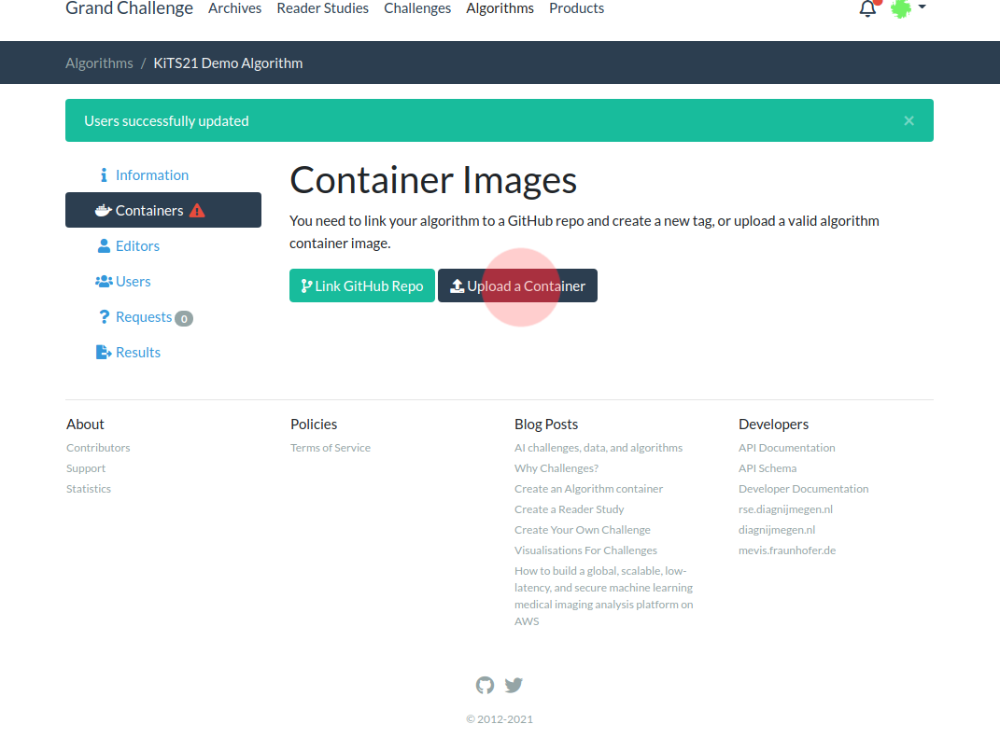

That will bring you to a form which will ask you how much RAM you need (max 24GB) and ask if GPU is needed, and then ask you to upload your `.tar.gz` file.

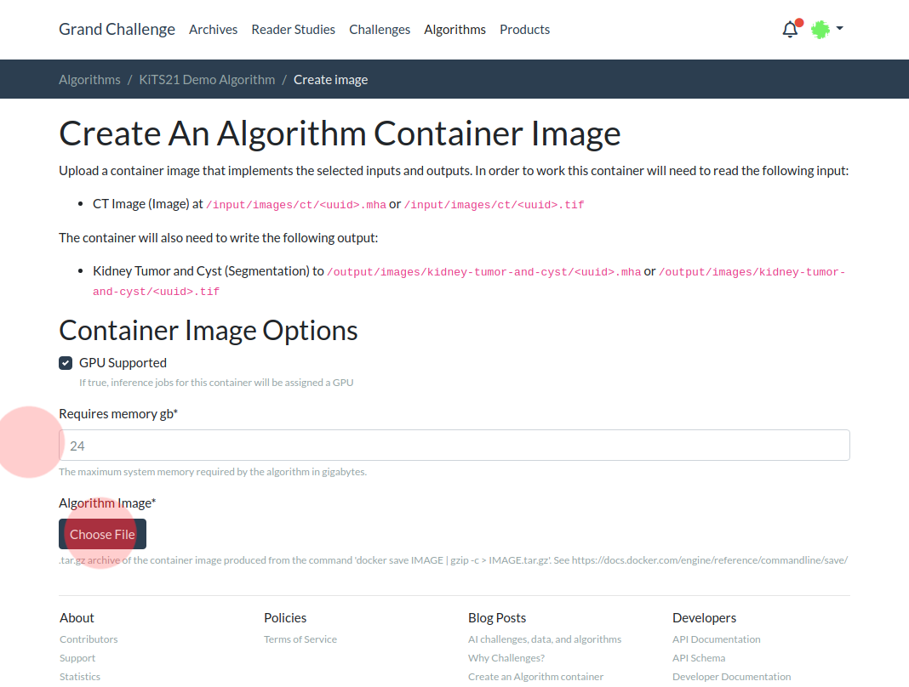


After your docker container is uploaded, it will be screened for errors. Please address any issues that are raised and **only proceed to the next step after your algorithm shows "Ready: `True`"**

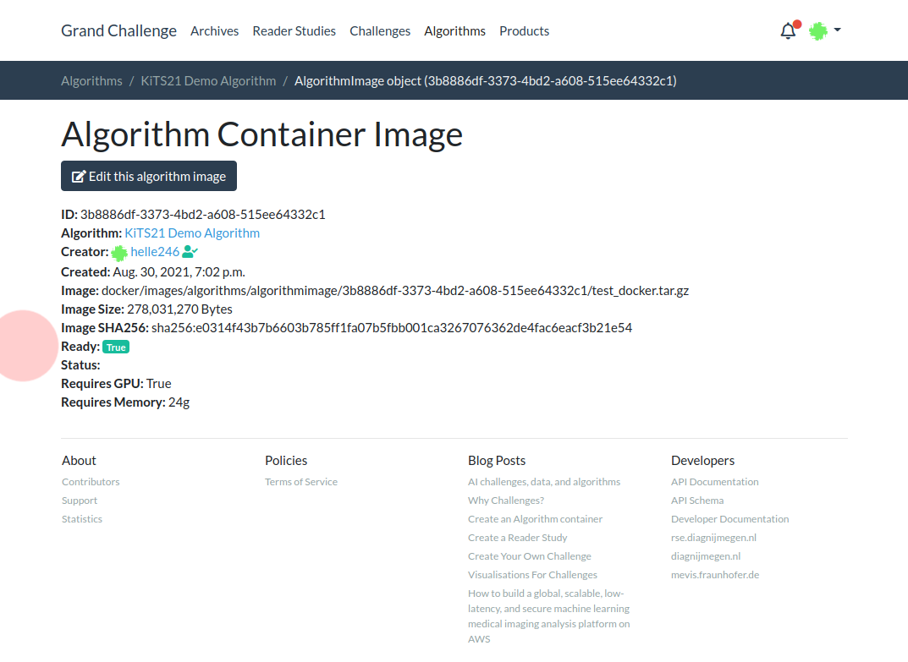


## Initiate Your Inference Job

Once your algorithm is created with the correct configuration and you have uploaded a container which was error checked without issue, you are ready to initiate your inference job. You can do this by filling out [this form](https://kits21.kits-challenge.org/inference-request) which asks for

- Your Grand Challenge Username
- Your Team's "Secret"
  - You should have received this via email. Please contact Nicholas Heller at helle246@umn.edu if you have not received one
- Your Algorithm's URL
  - e.g., `https://grand-challenge.org/algorithms/kits21-demo-algorithm/`

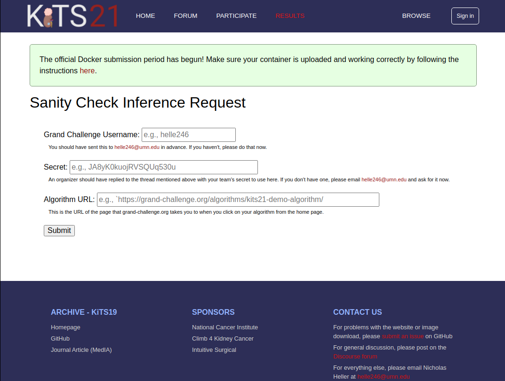

Once the form is submitted, the page will either show an error message or it will provide a link to a page back on grand-challenge.org where you can monitor the progress of your inference jobs.

Once they have finished, you will be able to download the predicted segmentations in order to check them against your expected output.
